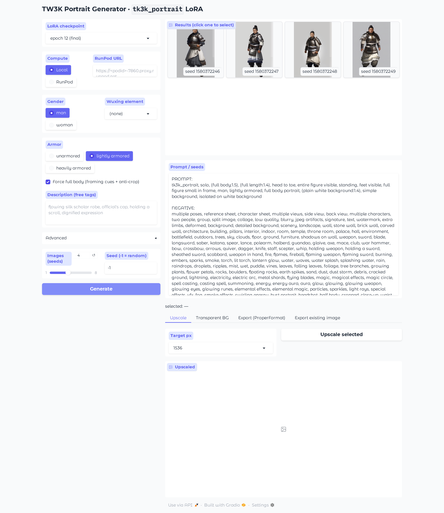

# TW3K Portrait Generator

A local web app for generating *Total War: THREE KINGDOMS*–style character portraits
using a custom **SDXL LoRA** (`tk3k_portrait`) trained on the SAD modpack art style.
Generate new in-style portraits from a few tags, then upscale, strip the background, or
export them straight into the mod's **ProperFormat** character folder structure
(composites + stills: mini / bobblehead / half-body / unit-card).

The UI is a [Gradio](https://www.gradio.app/) app; generation runs **locally on your
own NVIDIA GPU**.



---

## Contents

- [Requirements](#requirements)
- [Setup](#setup)
- [Download the models](#download-the-models)
- [Run the website](#run-the-website)
- [Using the app](#using-the-app)
- [Command-line usage](#command-line-usage)
- [Project structure](#project-structure)
- [Troubleshooting](#troubleshooting)
- [Credits & license](#credits--license)

---

## Requirements

| | |
|---|---|
| **OS** | Windows 10/11 (the included `start.bat` is Windows; on Linux/macOS run the Python command directly) |
| **GPU** | **NVIDIA GPU with ≥ 8 GB VRAM** (12 GB recommended). CUDA is required — the app runs on `cuda` and has no CPU/Apple-Silicon fallback. |
| **Driver/CUDA** | A recent NVIDIA driver. `requirements.txt` installs the **CUDA 12.1** build of PyTorch. |
| **Python** | 3.10 or **3.11** (developed on 3.11) |
| **Disk** | ~10 GB free (6.5 GB SDXL base + 436 MB LoRA + deps) |

---

## Setup

### 1. Clone the repository

```bash
git clone https://github.com/Ironictw2st/tkart-portrait-generator.git
cd tkart-portrait-generator
```

### 2. Create and activate a virtual environment

The included `start.bat` expects a venv at `.venv/`.

**Windows (PowerShell):**
```powershell
py -3.11 -m venv .venv
.\.venv\Scripts\Activate.ps1
```

**Linux/macOS:**
```bash
python3.11 -m venv .venv
source .venv/bin/activate
```

### 3. Install dependencies

```bash
python -m pip install --upgrade pip
pip install -r requirements.txt
```

> This pulls the **CUDA 12.1** PyTorch wheels. If you have a different CUDA version,
> edit the `--extra-index-url` and the `+cu121` suffixes in `requirements.txt` to match
> (see <https://pytorch.org/get-started/locally/>).

---

## Download the models

Two checkpoints are **not** included in the repo (too large for git). Download both and
place them at the exact paths below.

### a) SDXL base (~6.5 GB)

Download `sd_xl_base_1.0.safetensors` from Hugging Face (free account; accept the license):

<https://huggingface.co/stabilityai/stable-diffusion-xl-base-1.0/blob/main/sd_xl_base_1.0.safetensors>

Save it as:
```
models/sd_xl_base_1.0.safetensors
```

### b) The trained LoRA (~436 MB)

Download `tk3k_portrait_v3.safetensors`:

> **➡ Download** (Hugging Face): <https://huggingface.co/Ironictw2st/tk_3k_portraits>
>
> Grab `tk3k_portrait_v3.safetensors` (direct link:
> <https://huggingface.co/Ironictw2st/tk_3k_portraits/resolve/main/tk3k_portrait_v3.safetensors>)

Save it as:
```
output/v3/tk3k_portrait_v3.safetensors
```

The app lists every `*.safetensors` in `output/v3/` in its LoRA dropdown, so you can add
extra epoch checkpoints there too.

---

## Run the website

**Windows — easiest:** double-click **`start.bat`** (or run it from a terminal). It
launches the server and opens <http://127.0.0.1:7860> in your browser after ~20 seconds
(the SDXL base takes a moment to load into VRAM on first start).

**Any OS — directly:**
```bash
# with the venv activated:
python scripts/app.py
```
Then open <http://127.0.0.1:7860>.

The first launch loads the 6.5 GB base model into VRAM (this is the slow part); after
that, switching LoRA checkpoints only swaps the small LoRA weights.

To stop the server: close the window or press `Ctrl+C` in the terminal.

---

## Using the app

1. **LoRA checkpoint** — pick the trained model (defaults to `tk3k_portrait_v3.safetensors`).
2. **Gender / Wuxing element / Armor** — quick preset tags.
3. **Force full body** — adds framing cues + anti-crop negatives and switches to a
   portrait aspect (832×1216) so you get a head-to-toe figure instead of a bust.
4. **Description** — free-form tags, e.g.
   `flowing silk scholar robe, official's cap, holding a scroll, dignified expression`.
5. **Advanced** — negative prompt, LoRA weight, steps, CFG.
6. **Images / Seed** — number of seeds to render; `-1` = random.
7. Click **Generate**. Click any result thumbnail to **select** it, then use the tabs:
   - **Upscale** — hi-res img2img refine of the selected image.
   - **Transparent BG** — strip the background to RGBA (via `rembg`).
   - **Export (ProperFormat)** — write the selected image into the mod's character
     folder structure under `output/mod/<character_id>/` (composites + all still types).
   - **Export existing image** — upload any image and export it the same way.

**Trigger word:** the LoRA is keyed on `tk3k_portrait` (added automatically by the app).

> **Compute = RunPod** is an optional advanced mode for offloading generation to a remote
> pod running this same app. Leave it on **Local** for normal use.

---

## Command-line usage

You can generate and upscale without the web UI:

```bash
# Generate a full artset (norm/happy/angry × large/small panels) for a character:
python scripts/generate.py --slug cao_pi --gender male --element fire --seed 42
#   -> output/artsets/SAD_cao_pi_fire/...

# Export a generated image into the mod's ProperFormat structure:
python scripts/export_proper.py <image.png> <character_id>
#   -> output/mod/ui/characters/<character_id>/...
#   (also batch mode: pass a directory instead of a single image)

# Hi-res upscale an image:
python scripts/upscale.py <in.png> <out.png> "your prompt" [denoise=0.35] [target_px=1536]
```

---

## Project structure

```
tkart-portrait-generator/
├── start.bat                # Windows launcher (opens the browser too)
├── requirements.txt
├── README.md
├── scripts/
│   ├── app.py               # the Gradio web app (main entry point)
│   ├── export_proper.py     # export to the mod's ProperFormat (composites + stills)
│   ├── generate.py          # CLI: generate a full character artset
│   └── upscale.py           # CLI: hi-res img2img upscale
├── models/                  # place sd_xl_base_1.0.safetensors here
└── output/
    ├── v3/                  # place tk3k_portrait_v3.safetensors here
    ├── ui/                  # generated images (created on first run)
    └── mod/                 # ProperFormat exports (created on export)
```

---

## Troubleshooting

- **`Pick a LoRA checkpoint first` / empty dropdown** — the LoRA isn't in `output/v3/`.
  See [Download the models](#download-the-models).
- **`FileNotFoundError ... sd_xl_base_1.0.safetensors`** — the base model isn't in
  `models/`.
- **CUDA / "no kernel image" / out-of-memory errors** — make sure you installed the
  **CUDA build** of PyTorch (it ships in `requirements.txt`) and that your GPU has enough
  free VRAM. Close other GPU-heavy apps. `torch.cuda.is_available()` must return `True`.
- **"A module that was compiled using NumPy 1.x cannot be run in NumPy 2.x"** — harmless
  if you used the pinned `numpy==1.26.4`; if you see it, run `pip install "numpy<2"`.
- **`No module named 'triton'` / xformers FutureWarnings** — harmless on Windows; the app
  still runs. You can remove the `xformers` line from `requirements.txt` if it won't
  install.
- **Browser didn't open** — just visit <http://127.0.0.1:7860> manually. Increase the
  `timeout /t 20` in `start.bat` if your machine loads the model more slowly.

---

## Credits & license

- Built on **Stable Diffusion XL** by Stability AI — your use of the base model is subject
  to the [SDXL 1.0 license](https://huggingface.co/stabilityai/stable-diffusion-xl-base-1.0/blob/main/LICENSE.md).
- The `tk3k_portrait` LoRA was trained on art from the *Total War: THREE KINGDOMS* SAD
  modpack. This is **non-commercial fan content**; *Total War: THREE KINGDOMS* and its art
  are property of their respective owners. Respect the original mod's and game's terms.
- App/scripts in this repo are released under the [MIT License](LICENSE). (The MIT
  license covers the code only — not the SDXL base model or the LoRA weights.)
